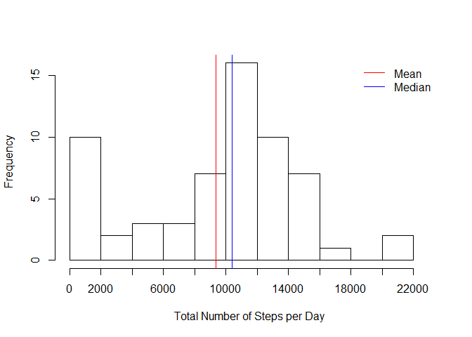
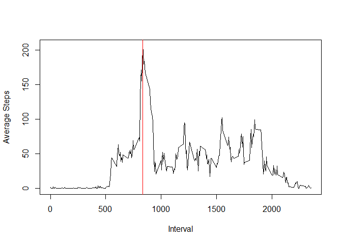
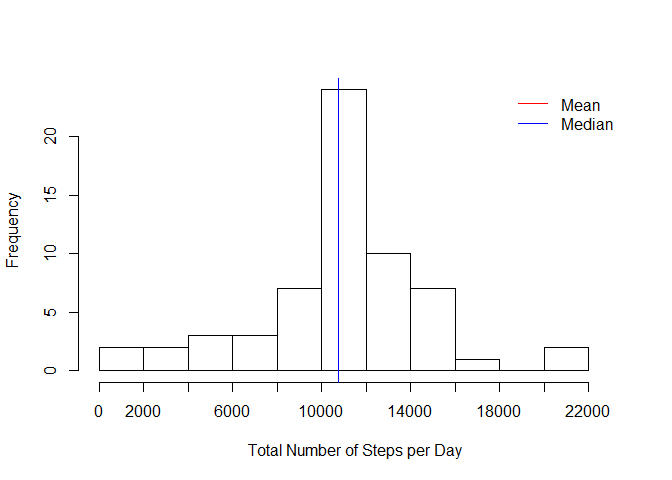
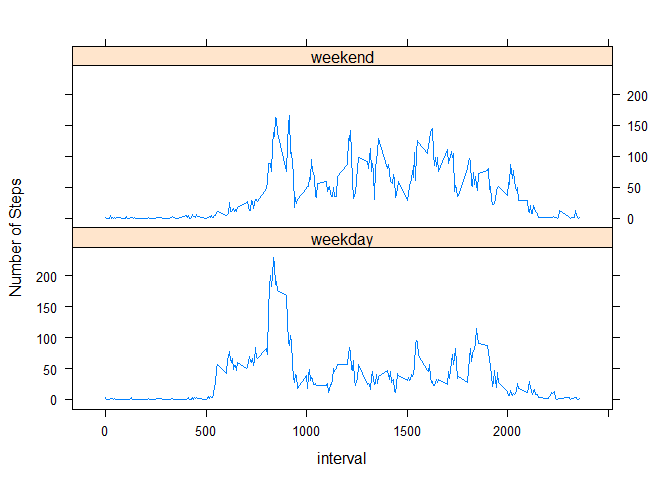

# Reproducible Research: Peer Assessment 1


## Loading and preprocessing the data

First install and library the relevant packages, for this project I used lubridate for date management and lattice for plotting

```r
library(lubridate)
library(lattice)
```


Then I unpacked the sample data and read it into RStudio and imediately changed the date column class to Date using lubridate.


```r
unzip("activity.zip", exdir = ".")
activity <- read.csv("activity.csv", header=TRUE, stringsAsFactors = FALSE, na.strings = "NA")
activity$date <- ymd(activity$date) 
```
I now had a tidy data set called activity to work with.

## What is mean total number of steps taken per day?

To answer this, I aggregated the step count by date, removing NA values in the process 

```r
totalsteps <- aggregate(activity$steps, by = list(date = activity$date), FUN=sum, na.rm=TRUE)
```
Then I plotted a histogram showing the frequency of various step counts 

```r
## Drawing the plot
hist(totalsteps$x, 
     breaks = 15, 
     xlab = "Total Number of Steps per Day", 
     main = "", 
     xlim = c(0,23000),
     xaxt = 'n')
axis(side =1, at =seq(0,23000,2000), labels = seq(0,23000,2000))

##Adding the mean and median to the plot
abline(v = mean(totalsteps$x), col="red")
abline(v=median(totalsteps$x), col="blue")
legend("topright", inset =.02, legend=c("Mean", "Median"), col=c("red","blue"), lty=1, box.lty=0)
```

<!-- -->

From the data we can see that the mean number of steps is 9354.23, while the median is 10395.

## What is the average daily activity pattern?

To understand the average daily patterns I first found the average number of steps for each interval 

```r
##Average steps per 5 min interval
avesteps<-aggregate(activity$steps, by = list(interval=activity$interval), FUN=mean, na.rm=TRUE)
plot(avesteps$interval, avesteps$x, type ="l", ylab = "Average Steps", xlab ="Interval")
abline(v= with(avesteps, interval[x == max(x)]), col="red")
```

<!-- -->

The 5 minute interval 835 contains the maximum number of steps on average

## Imputing missing values

I computed the number of NA values in the existing data set.


```r
sum(is.na(activity$steps))
```

```
[1] 2304
```

To impute the missing values I used the interval average as calculated previously

```r
##create a new data set
activity2 <- activity

##runing through the existing dataset and replacing missing values 
i <- 1
while (i <= length(activity2$steps)) {
        if (is.na(activity2$steps[i]))
                {activity2$steps[i] <- avesteps$x[avesteps$interval == activity2$interval[i]]
                i = i + 1
                }
        else {i = i + 1}       
}
```

As a check I computed the number of missing values in the new data set

```r
sum(is.na(activity2$steps))
```

```
[1] 0
```


```r
totalsteps2 <- aggregate(activity2$steps, by = list(date = activity$date), FUN=sum)
hist(totalsteps2$x, 
     breaks = 15, 
     xlab = "Total Number of Steps per Day", 
     main = "", 
     xlim = c(0,23000),
     xaxt = 'n')
axis(side =1, at =seq(0,23000,2000), labels = seq(0,23000,2000))
##Adding the mean and median to the plot

abline(v = mean(totalsteps2$x), col="red")
abline(v=median(totalsteps2$x), col="blue")
legend("topright", inset =.02, legend=c("Mean", "Median"), col=c("red","blue"), lty=1, box.lty=0)
```

<!-- -->

Both the mean and the median of the total number of steps taken per day were calculated to be 10766.19,Using the interval average to impute the missing data is a vaible option leading in only marginal difference from the mean and median values of the original data set. 

## Are there differences in activity patterns between weekdays and weekends?

```r
##Differences in activity between weekends and weeekdays

activity2$daytype <- NULL
i <- 1

while (i <= length(activity2$date)) {
        if (wday(activity2$date[i]) == 1  || wday(activity2$date[i]) == 7)
        {
                activity2$daytype[i] <- "weekend"
                i = i + 1
        }
        else {
                activity2$daytype[i] <- "weekday"
                i = i +1
        }       
}

##plotting 2 panel plots
par(mfrow=c(2,1))

avesteps2<-aggregate(activity2$steps, by = list(interval=activity2$interval, daytype = activity2$daytype), FUN=mean)
xyplot(x~interval | daytype, data = avesteps2 , type="l", ylab = "Number of Steps", layout=c(1,2))
```

<!-- -->

Further investigation would be required to better categorise the diferences, but the exploratory analysis does show some variation in the activity patterns of weekdays and weekends. In general we see more activity in the early stages of the weekdays, but more sustained activity during the weekend days.  
